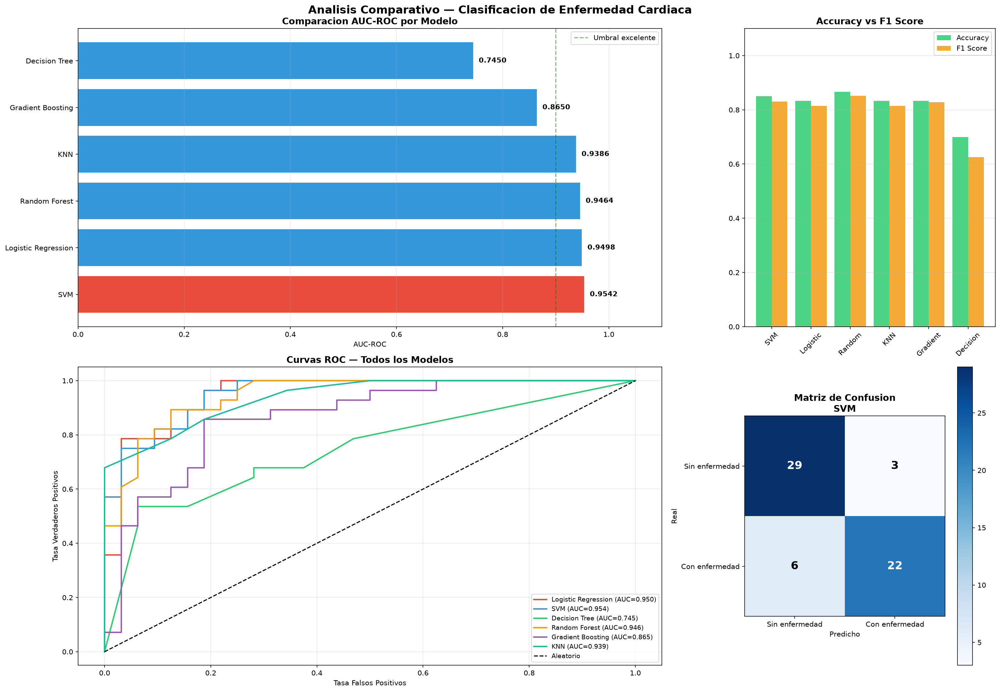
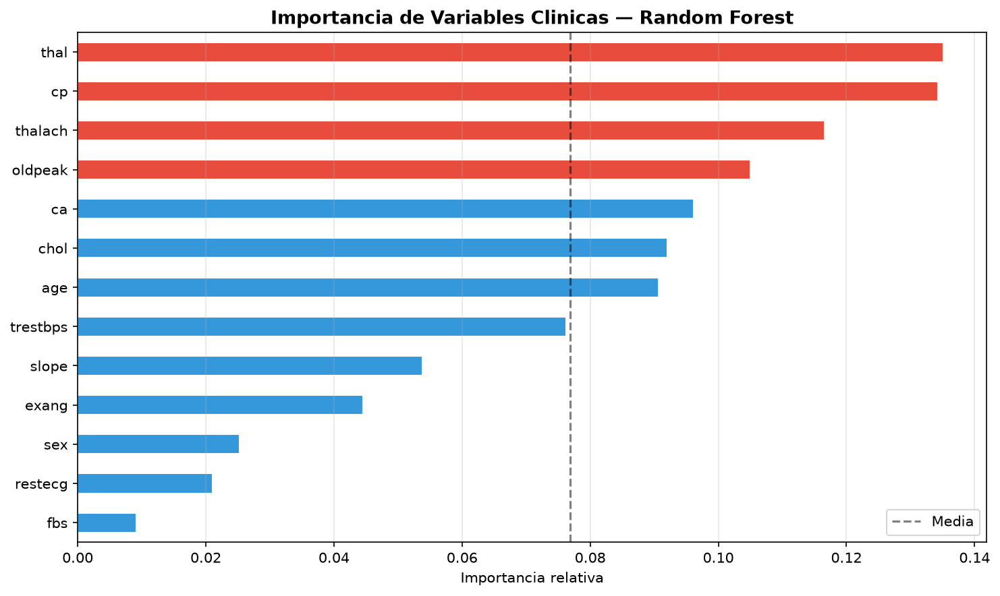

# Heart Disease Classification — ML Pipeline + Dashboard Interactivo


## Descripcion

Pipeline completo de clasificacion para deteccion de enfermedades cardiacas usando el dataset
Heart Disease UCI (303 pacientes, 13 variables clinicas). Incluye dashboard interactivo con Dash
para exploracion visual de resultados en tiempo real.

## Modelos evaluados

| Modelo | Tipo |
|---|---|
| Logistic Regression | Estadistico clasico |
| SVM | Margen maximo |
| Decision Tree | Arbol de decision |
| Random Forest | Ensamble - Bagging |
| Gradient Boosting | Ensamble - Boosting |
| KNN | Basado en distancia |

## Resultados

| Modelo | AUC | Accuracy | F1 | CV AUC |
|---|---|---|---|---|
| **SVM** | **0.9542** | 0.8500 | 0.8302 | 0.8674 |
| Logistic Regression | 0.9498 | 0.8333 | 0.8148 | 0.8698 |
| Random Forest | 0.9464 | **0.8667** | **0.8519** | **0.8850** |
| KNN | 0.9386 | 0.8333 | 0.8148 | 0.8697 |
| Gradient Boosting | 0.8650 | 0.8333 | 0.8276 | 0.8649 |
| Decision Tree | 0.7450 | 0.7000 | 0.6250 | 0.7637 |

### Comparacion de modelos


### Importancia de variables clinicas


## Analisis y Conclusiones

**Mejor modelo por AUC: SVM (0.9542)**
El SVM supera al resto en capacidad discriminativa (AUC), logrando separar correctamente
pacientes sanos y enfermos en el 95.4% de los casos segun la curva ROC.

**Mejor modelo por Accuracy y F1: Random Forest (86.7% / 0.852)**
El Random Forest obtiene la mayor precision global y el mejor F1, lo que lo hace mas robusto
para uso clinico donde importa tanto precision como recall.

**Variables mas relevantes (Random Forest):**
- `thal` (Talasemia) y `cp` (tipo de dolor de pecho) son los predictores mas importantes,
  superando el 13% de importancia relativa cada uno.
- `thalach` (frecuencia cardiaca maxima) y `oldpeak` (depresion ST) completan el top 4.
- `fbs` (glucosa en ayunas) y `restecg` (ECG en reposo) son los menos informativos.

**Observaciones clinicas:**
- Los modelos lineales (Logistic Regression) compiten con ensambles complejos, lo que sugiere
  que las relaciones entre variables clinicas y enfermedad son en gran medida lineales.
- Decision Tree tiene el peor desempeno (AUC=0.745), confirmando su tendencia al sobreajuste
  sin regularizacion adicional.
- Los 6 modelos superan AUC=0.74, lo que valida la calidad predictiva del conjunto de variables.

## Dashboard Interactivo

El dashboard permite:
- Comparar modelos por AUC, Accuracy y F1 de forma dinamica
- Visualizar curvas ROC de todos los modelos simultaneamente
- Explorar la matriz de confusion por modelo seleccionado
- Analizar la distribucion de variables clinicas por clase
- Ver la importancia de variables del Random Forest

```bash
cd src
python dashboard.py
# Abrir http://127.0.0.1:8050
```

## Estructura

```
heart-disease-classification/
├── src/
│   ├── main.py
│   ├── data_loader.py
│   ├── preprocessing.py
│   ├── models.py
│   ├── evaluate.py
│   └── dashboard.py
├── data/
├── outputs/
├── models/
└── notebooks/
```

## Reproducir

```bash
git clone https://github.com/eider043/heart-disease-classification.git
cd heart-disease-classification
pip install -r requirements.txt
cd src
python main.py
python dashboard.py
```

## Autor
**Eider** — Científico de Datos  
[](https://www.fiverr.com/eiderdatadriven)
